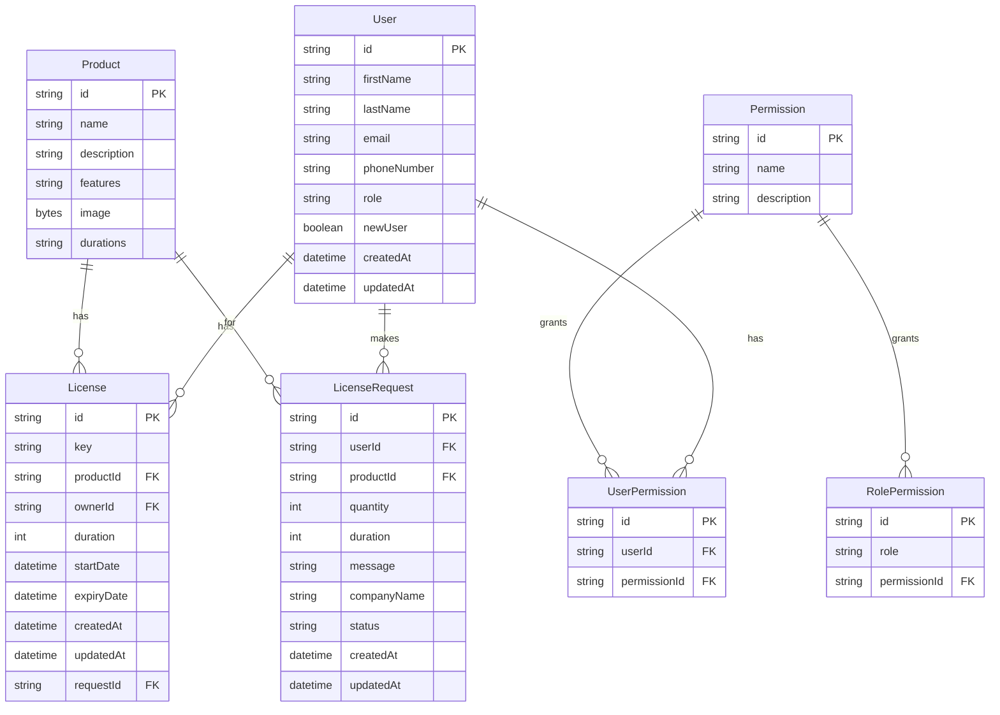

# Lienzo - Enterprise Software License Management System

## Overview

Lienzo is a comprehensive enterprise-level software license management system designed to streamline the process of purchasing, managing, and tracking software licenses for businesses of all sizes. Built with Next.js, TypeScript, and Prisma, Lienzo offers a robust and user-friendly platform for both license administrators and end-users.

## Key Features

1. **User Authentication and Role Management**
2. **License Management**
3. **Product Catalog**
4. **License Request System**
5. **Admin Dashboard**
6. **User Dashboard**
7. **Reporting and Analytics**

## Tech Stack

- **Frontend**: Next.js, React, TypeScript
- **Backend**: Next.js API Routes
- **Database**: SQLite (via Prisma ORM)
- **Authentication**: Kinde Auth
- **UI Components**: Tailwind CSS, shadcn/ui
- **State Management**: React Query
- **Form Handling**: React Hook Form
- **Date Handling**: Day.js

## Project Structure

- `/app`: Next.js app directory containing pages and API routes
- `/components`: Reusable React components
- `/lib`: Utility functions and shared logic
- `/prisma`: Database schema and migrations
- `/public`: Static assets
- `/types`: TypeScript type definitions

## Database Schema



## Setup and Installation

1. Clone the repository:
   ```
   git clone https://github.com/your-username/lienzo.git
   cd lienzo
   ```

2. Install dependencies:
   ```
   npm install
   ```

3. Set up environment variables:
   - Copy `.env.example` to `.env`
   - Fill in the required variables, including Kinde Auth credentials

4. Set up the database:
   ```
   npx prisma generate
   npx prisma migrate dev
   ```

5. (Optional) Seed the database with initial data:
   ```
   npx prisma db seed
   ```

6. Start the development server:
   ```
   npm run dev
   ```

7. Open `http://localhost:3000` in your browser to view the application

## Deployment

The project is designed to be deployed on Vercel or similar platforms that support Next.js applications.

## Future Enhancements

- Integration with popular software vendors for automated license provisioning
- Advanced analytics and reporting features
- Multi-tenant support for managing licenses across different organizations
- Mobile app for on-the-go license management

## Contributing

Contributions are welcome! Please read our contributing guidelines and code of conduct before submitting pull requests.

## License

[MIT License](LICENSE)

## Tech Team

Developed by OonkoO - [https://oonkoo.com](https://oonkoo.com)

---

Lienzo - Empowering businesses with efficient software license management.